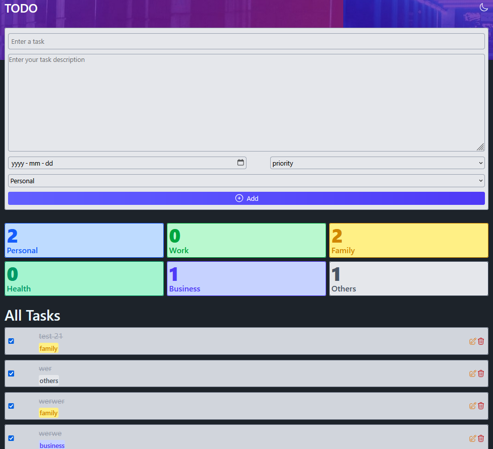

# 🧾 React To-Do List App

A stylish and functional To-Do list app built with **React**, **Tailwind CSS**, and **DaisyUI**. Organize your tasks by category, set deadlines and priorities, and track your task count per category in real-time.

## 🚀 Features

- 📝 Add task with:
  - Title
  - Description
  - Due date
  - Priority
  - Category (Personal, Work, Family, Business, Health, Others)
- 📊 Task summary with category-wise counters
- 🎨 Clean and responsive UI using Tailwind CSS + DaisyUI
- 🌙 Dark mode ready
- ✏️ Edit and delete tasks easily

## 📸 Screenshot



## 🛠️ Built With

- [React](https://reactjs.org/)
- [Tailwind CSS](https://tailwindcss.com/)
- [DaisyUI](https://daisyui.com/)
- [Vite](https://vitejs.dev/)

## 🧑‍💻 Getting Started

1. Clone the repo

```bash
git clone https://github.com/Lil-Code30/to-do-App.git
cd to-do-App
```

2. Install dependencies

```bash
npm install
```

3. Start the development server

```bash
npm run dev
```

📦 Build for production

```bash
npm run build
```
